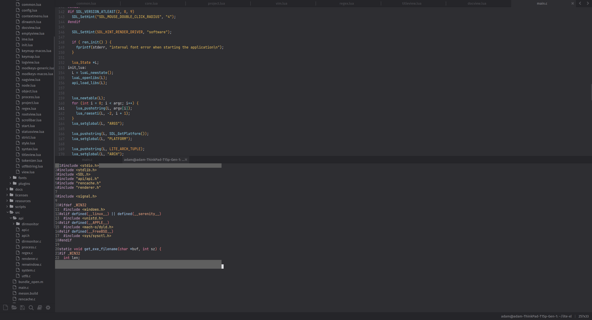

# quetta

Turns lite-xl into a vim-like terminal-based editor.

## Why god why?

Yo dawg.



## To run (with mod-version 4)

```
clear && BIN=libvim.so ./build.sh && lpm run vim --reinstall --symlink -- ~/lite-xl/src/main.c
```
